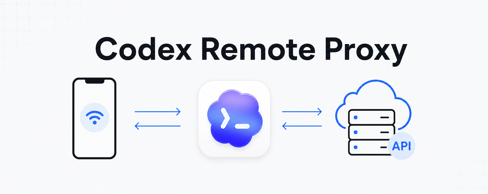

# Codex Remote Proxy 中文文档

Codex Remote Proxy 的作用很直接：

- 保留 Codex 的 ChatGPT 登录态，用于手机端远程连接和远程控制
- 把真实模型请求转发到你自己的 OpenAI 兼容 `base_url`
- 把请求头里的 `Authorization` 改写成真实 API key

已发布到 npm：

```bash
npm install -g @cluic/codex-remote-proxy
```

## 它解决了什么问题

Codex 的两个本地文件分别控制不同事情：

- `~/.codex/config.toml` 决定请求发往哪里
- `~/.codex/auth.json` 决定 `Authorization` 里放什么

当 Codex 处于 ChatGPT 登录模式时，发出去的通常不是普通 API key，而是 `tokens.access_token`。很多第三方 OpenAI 兼容服务并不接受这个值，所以即使 `base_url` 改对了，也可能无法正常对话。

这个项目通过本地代理解决这个错位。

## 推荐安装方式

当前最推荐的路径是 Node 版本，也是目前已验证可正常转发和对话的主路径。

### 全局安装

```bash
npm install -g @cluic/codex-remote-proxy
```

然后执行：

```bash
crp init
crp start
```

### 不做全局安装

```bash
npx @cluic/codex-remote-proxy init
npx @cluic/codex-remote-proxy start
```

### 直接从当前仓库运行

```bash
cd node
npm install
node bin/crp.mjs start
```

完成后：

1. 重启 Codex Desktop
2. 使用 ChatGPT 账号登录
3. 正常继续使用 Codex

## 全局目录

CLI 统一管理目录：

```text
~/.codex-remote-proxy/
```

这里会保存：

- 运行配置
- 托管状态
- 代理日志
- 可选的本地 shim 文件

## 密钥处理方式

你不必每次都把 `base_url` 和 `api_key` 再传给 `crp start`。

推荐三种方式：

### 方式 1：写进 `~/.codex/config.toml`

可以额外加一段：

```toml
[codex_remote_proxy]
upstream_base_url = "https://your-upstream.example.com"
upstream_api_key = "sk-your-key"
```

之后直接执行：

```bash
crp start
```

### 方式 2：本地保存一次

```bash
crp init
crp start
```

`crp init` 会把配置保存到：

```text
~/.codex-remote-proxy/config.json
```

之后只需要：

```bash
crp start
```

### 方式 3：使用环境变量

```bash
export CRP_UPSTREAM_BASE_URL="https://your-upstream.example.com"
export CRP_UPSTREAM_API_KEY="sk-your-key"
crp start
```

`crp start` 的取值优先级是：

1. CLI 参数
2. 环境变量
3. `~/.codex/config.toml` 里的 `[codex_remote_proxy]`，键名使用 `upstream_base_url` 和 `upstream_api_key`
4. `crp init` 保存的本地配置
5. 交互式输入

## 全局 CLI

主要命令：

- `crp check`
  查看 Codex 配置、鉴权模式、运行时状态和托管服务状态

- `crp start`
  从 CLI 参数、环境变量、`~/.codex/config.toml` 的 `[codex_remote_proxy]` 或交互输入中获取上游配置，自动选择空闲端口，修改 Codex 配置，并默认后台启动代理

- `crp init`
  先把上游配置安全保存到 `~/.codex-remote-proxy/`，如果你不想把密钥写进 `~/.codex/config.toml`，以后 `crp start` 也不需要再重复输入

- `crp install`
  与 `crp start` 等价的兼容别名

- `crp status`
  查看当前托管服务状态和健康检查结果。如果代理在运行但不是 CLI 托管的，也会尝试探测

- `crp stop`
  停止托管服务

- `crp guide`
  输出给 AI 读取的调用说明

常见 JSON 调用方式：

```bash
crp check --json
crp guide --json
crp status --json
```

## 给 AI 的建议

建议流程：

1. 先跑 `crp check --json`
2. 读取 `recommendedImplementation`
3. 如果 Node 依赖就绪，优先走 `node`
4. 优先使用现有 `~/.codex/config.toml` 里的 `[codex_remote_proxy]`，并使用 `upstream_base_url` / `upstream_api_key` 这两个键，否则让用户先在本地跑一次 `crp init`，或者提前在系统里设置好环境变量
5. 再跑 `crp start`
6. 从返回结果中读取 `proxyUrl`、`pid`、`health`
7. 之后用 `crp status --json` 做确认

注意：

- `start` 会修改 `~/.codex/config.toml`
- `install` 会先创建备份
- 托管状态和日志保存在 `~/.codex-remote-proxy/`
- 如果你是直接从当前仓库运行，需要先执行 `cd node && npm install`
- `~/.codex/config.toml`、`crp init` 或环境变量模式都可以避免后续 AI 直接接触密钥

## 实现目录

- [./node](./node)
  npm 包实现

- [./node/RELEASING.md](./node/RELEASING.md)
  自动发布 npm 的配置与发布流程说明
